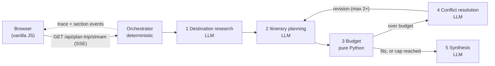

# Trip Planner: a Chain-of-Agents Orchestrator demo

A small web app in one container. You type a trip request ("Kyoto, 5 days, $1,200, solo, food and temples") and watch a **chain of specialised AI agents** pass the work along in real time until they produce a day-by-day itinerary that has been checked against your budget.

The point isn't a pretty itinerary. The point is to **make the orchestration visible**: which agent is working, what it passed to the next one, where a conflict came up (over budget) and how the chain resolved it without a human stepping in.

It implements three patterns from *"30 Agents Every AI Engineer Must Build"* (Imran Ahmad, Packt, ch. 7):

| Pattern | Where it lives |
|---|---|
| **Chain-of-Agents Orchestrator**: one component owns control flow and hand-offs, and does no domain work itself | `app/orchestrator.py` |
| **Memory-Augmented Multi-Agent System**: one shared context object that every agent reads and that grows by adding sections | `app/models.py` (`SharedContext`) |
| **Conflict Resolution Mechanism**: detects a broken constraint (budget) and makes two agents renegotiate, with a hard iteration cap | `app/agents/conflict_resolution.py` plus the loop in the orchestrator |

## Architecture



- **Orchestrator** (`app/orchestrator.py`): control flow written as code, with no LLM involved: research → itinerary → budget → [conflict → itinerary revision → budget] ×≤2 → synthesis. It is the only component that merges results into the shared context. It emits a `trace` event before and after every step.
- **Destination Research** (LLM): notes on the season, 2–3 recommended areas, and reference costs.
- **Itinerary Planning** (LLM): a day-by-day plan grouped by area. It also commits to daily cost assumptions for lodging, food and transport. The conflict loop re-invokes it with concrete revision instructions.
- **Budget** (no LLM): adds up lodging, food, activities and transport in Python and compares the total to the budget. Arithmetic stays out of the model so the model can't get a sum wrong.
- **Conflict Resolution** (LLM): when the plan is over budget, proposes the 2–3 most effective cuts. They're fed back to the itinerary agent.
- **Synthesis** (LLM): writes a short, warm narrative. If the plan still doesn't fit after 2 iterations, it says so. If the token budget runs out, a deterministic template writes the summary instead.

### The shared context (`SharedContext`)

One JSON object travels through the whole chain. Every agent receives all of it and returns **only its own section**. Sections are never deleted; a section is only replaced by a newer revision of itself.

```jsonc
{
  "session_id": "uuid",
  "user_request":        { "destination": "Kyoto", "days": 5, "budget_usd": 1200, "travelers": 1, "interests": ["food", "temples"] },
  "destination_research":{ "season_notes": "…", "recommended_areas": ["…"], "reference_costs": { "lodging_per_night_usd": 0, "meal_avg_usd": 0, "local_transport_day_usd": 0 }, "agent_notes": "…" },
  "itinerary_draft":     { "days": [{ "day": 1, "area": "…", "activities": ["…"], "estimated_cost_usd": 0 }], "cost_assumptions": { "lodging_per_night_usd": 0, "food_per_day_usd": 0, "transport_per_day_usd": 0 }, "revision": 0 },
  "budget_analysis":     { "estimated_total_usd": 0, "over_budget_by_usd": 0, "breakdown": { "lodging": 0, "food": 0, "activities": 0, "transport": 0 }, "within_budget": true },
  "conflict_resolution": { "triggered": false, "iterations": 0, "actions_taken": [], "resolved": null },
  "final_itinerary":     { "summary": "…", "days": [], "total_cost_usd": 0, "budget_usd": 0, "within_budget": true, "breakdown": {} },
  "trace":               [{ "agent": "orchestrator", "event": "plan_created", "timestamp": "iso8601" }],
  "token_usage":         { "destination_research": { "input_tokens": 0, "output_tokens": 0 } }
}
```

Each LLM agent's output is constrained to a JSON schema (structured outputs) and validated with Pydantic. If the output is still invalid, the agent retries once and then fails in a controlled way.

## Stack

Python 3.12 · FastAPI + Uvicorn · Pydantic v2 · Anthropic Python SDK (Claude Haiku 4.5 for the four language agents) · Server-Sent Events · vanilla HTML/JS (no build step) · Docker.

## Prerequisites

- Docker, **or** Python 3.12+.
- An Anthropic API key for real runs. Without one, the app starts in **mock mode**: agents return deterministic, simulated output with no network calls and no cost. Mock mode is handy for UI work and it's what the tests use.

## Build & run

### Docker

```bash
docker build -t trip-planner .
docker run --rm -p 8080:8080 -e ANTHROPIC_API_KEY=sk-ant-... trip-planner
# open http://localhost:8080
```

To run without a key, drop `-e ANTHROPIC_API_KEY`. The app then runs in mock mode.

A prebuilt public image is published as `ghcr.io/alulema/trip-planner:latest`.

### Local Python

```bash
python -m venv .venv && source .venv/bin/activate
pip install -r requirements-dev.txt
export ANTHROPIC_API_KEY=sk-ant-...          # optional; omit for mock mode
uvicorn app.main:app --host 0.0.0.0 --port 8080 --reload
python -m pytest -q                           # offline test suite
```

## Configuration (environment variables)

| Variable | Default | Purpose |
|---|---|---|
| `ANTHROPIC_API_KEY` | – | Credential for the Anthropic API. Read at runtime only and never baked into the image. |
| `LLM_MODE` | `anthropic` if a key is set, else `mock` | Set `mock` to force the offline, zero-cost mode. |
| `DOMAIN_MODEL` | `claude-haiku-4-5` | Model used by the LLM agents. |
| `MAX_TOKENS_PER_SESSION` | `8000` | Token budget for one trip (all LLM calls combined). |
| `MAX_REQUESTS_PER_IP_PER_HOUR` | `10` | Per-client rate limit (in memory, using `X-Forwarded-For` when present). |
| `MAX_SESSIONS_PER_HOUR` | `30` | Limit on trips per hour across all clients. |
| `MAX_CONCURRENT_SESSIONS` | `3` | Maximum number of chains running at the same time. |
| `CHAIN_TIMEOUT_SECONDS` | `45` | Hard wall-clock limit for one chain. |
| `MAX_CONFLICT_ITERATIONS` | `2` | Conflict-loop cap. Values above 2 are clamped to 2. |
| `MOCK_LATENCY_MS` | `600` | Simulated latency per agent in mock mode. |
| `PROJECT_ID`, `DEMO_SLOT` | – | Optional identifiers reported by `/api/health`. |

## Usage

1. Open `/`, fill in the destination, days (1–7), budget, travelers and interests, then click **Plan trip**.
2. The **Agent trace** panel (left) shows every step as it happens: ⏳ working, ✅ done, ⚠️ conflict detected. Each step shows its duration and tokens.
3. The **Itinerary** panel (right) fills in as it goes: first the research, then the draft (day by day), then the budget breakdown and any conflict resolution, and finally the narrative summary.
4. **Try an unrealistic budget ($50)** forces the conflict loop. You'll see two negotiation rounds, and the result honestly reports that the plan is still over budget.

### HTTP API

| Endpoint | Description |
|---|---|
| `GET /` | Single-page UI. |
| `GET /api/health` | Liveness: `{"status":"ok", …}`. |
| `GET /api/config` | Public, non-secret settings (mode, model, limits). |
| `GET /api/plan-trip/stream?destination=&days=&budget_usd=&travelers=&interests=a,b&lang=es\|en` | SSE stream of the chain. |

Stream events: `session` (id and mode), `trace` (one per step transition), `section` (`{key, value}` whenever a context section changes), `done` (the full final context) or `error` (`{code, message}`, where `code` is one of `invalid_request`, `rate_limited`, `global_limit`, `busy`, `timeout`, `chain_failed`, `internal`). Every outcome, including input validation errors and refusals, arrives as an SSE event so an `EventSource` client can show it. The client must close the `EventSource` after `done` or `error`, because an automatic reconnect would start a new paid run.

## Deployment notes

- The container is **stateless and ephemeral**. Nothing is stored between requests, so it can be stopped at any moment.
- It serves plain HTTP on `0.0.0.0:8080` from the root path `/`, with **no TLS and no authentication**. It is designed to run behind a reverse proxy or gateway that terminates TLS and handles authentication. SSE responses set `Cache-Control: no-cache` and `X-Accel-Buffering: no` so proxies stream them instead of buffering.
- If the client disconnects mid-run, the chain is cancelled so it stops spending tokens.
- Cost guardrails are on by default (see the table above). Also set a hard spend limit in your Anthropic console.

## Limitations

- Costs are **LLM estimates from general knowledge**. There are no live flight, hotel or activity prices.
- Flights to the destination aren't included, only costs on the ground.
- Trips are capped at 7 days so a run fits the token budget.
- There is one night of lodging per trip day, which errs slightly on the high side.
- Rate limits live in memory and apply to a single replica.

## Possible v2

Real travel APIs (flights and hotels), an LLM controller for the orchestrator (for example, a stronger model deciding whether to loop again), a map view, and persisting finished plans.

## References

- Imran Ahmad, *30 Agents Every AI Engineer Must Build*, Packt, chapter 7: Chain-of-Agents Orchestrator, Memory-Augmented Multi-Agent Systems, Conflict Resolution Mechanisms.
