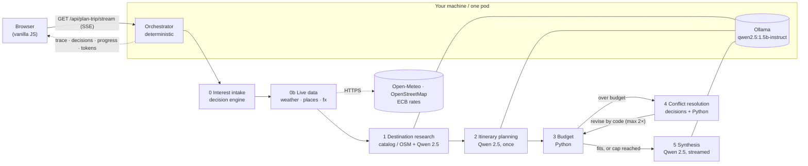

# Trip Planner: a Chain-of-Agents Orchestrator demo

You type a trip request ("Kyoto, 5 days, $1,200, solo, food and temples") and watch a **chain of specialised agents** pass the work along in real time until they produce a day-by-day itinerary that has been checked against your budget. The reasoning runs on your machine: a small local LLM (**Qwen 2.5 via Ollama**) plus a non-generative **decision engine**. Facts that change — the weather for your dates, districts and places for cities outside the curated catalog, the exchange rate — come from **free public data sources** (Open-Meteo, OpenStreetMap, ECB rates). No API keys are needed, and every live source is optional: if one is unreachable the chain falls back to the catalog or the model and says so.

The point isn't a pretty itinerary. The point is to **make the orchestration visible**: which agent is working, what it passed to the next one, which decisions it took (with their probabilities), where a conflict came up (over budget) and how the chain resolved it without a human stepping in.

It implements three patterns from *"30 Agents Every AI Engineer Must Build"* (Imran Ahmad, Packt, ch. 7):

| Pattern | Where it lives |
|---|---|
| **Chain-of-Agents Orchestrator**: one component owns control flow and hand-offs, and does no domain work itself | `app/orchestrator.py` (a LangGraph state graph) |
| **Memory-Augmented Multi-Agent System**: one shared context object that every agent reads and that only grows | `app/models.py` (`SharedContext`) |
| **Conflict Resolution Mechanism**: detects a broken constraint (budget) and renegotiates, with a hard iteration cap | `app/agents/conflict_resolution.py` + the orchestrator loop |

## Two kinds of reasoning: generate once, decide many times

A small model on a CPU produces only a few tokens per second, so the demo spends generation only where text actually has to be written. Every other step is either a **typed decision** or **plain arithmetic**:

| Step | Kind | How |
|---|---|---|
| Interest intake | decision | Map each free-text interest to a fixed taxonomy (food, religion/heritage, museums…) |
| Live data | live sources, **no LLM** | Geocode the destination, then fetch in parallel: the weather for the travel dates, districts and notable places (only outside the catalog) and the USD → local exchange rate. See [Live data](#live-data) |
| Destination research | live + catalog + **generative** | The season note is written by code from the real weather. For ~45 popular cities, real districts, well-known highlights and cost levels come from a curated catalog (`app/data/cities.json`), so with live weather the step generates nothing. Outside the catalog, districts and places come from OpenStreetMap and Qwen only estimates the cost level; if that fails too, Qwen estimates everything. The trace shows which source was used |
| Itinerary planning | **generative, once** | Qwen writes the day-by-day plan, **including a free alternative per day**. Days with rain in the real forecast are flagged, so the plan prefers indoor activities there |
| Budget | arithmetic | Python adds lodging, food, activities and transport, then compares the total to the budget |
| Conflict resolution | decision + arithmetic | Code computes each preset action's savings; the decision engine scores how much each action would hurt the traveller's interests; code ranks by `savings × (1 − P(harm))` |
| Itinerary revision | code | Code applies the chosen actions (swaps in the free alternatives, lowers daily costs). **No new generation** |
| Plan validation | decision | "Does the revised plan still match the interests?", answered as a probability and shown in the trace |
| Synthesis | **generative** + code | Qwen writes a short narrative, streamed token by token. It never sees any number and must not talk about money. The budget paragraph (total, the total in the local currency with the live rate and its source, cuts applied, fits or not) is written by code, so the honest part can't be hallucinated |

The **decision engine** (`app/decisions/`) follows the shape of *System-One* typed-decision models such as TypeSafe's Jev. The caller sends a *state* and a list of typed questions (`choice` with options, or `score` → P(yes)) and gets typed answers with probabilities back, never free text. Each question carries a machine `family` and a natural-language `text`, so engines are interchangeable. The engine that ships is **rule-based** (a keyword taxonomy plus explicit heuristics). It is deterministic, instant and offline. A model-backed engine only needs to implement `evaluate()`.

### Why a curated catalog

The first runs with the real 1.5B model got facts wrong: it put Shibuya (Tokyo) in Kyoto, invented districts and priced Hanoi above Lisbon. Prompts can't fix a small model's missing knowledge, so the facts that have to be right are stored as data. Each district in the catalog lists the highlights that are really located there. Code decides which district each day visits and passes the model only that district's highlights, so a landmark can't end up on the wrong day or in the wrong neighbourhood. The catalog is hand-written, reviewable and covered by tests, and it is matched by name, Spanish and English aliases or a small typo ("Kioto", "Lisboa", "Barcelonna"). The model still writes everything that is prose.

## Live data

`app/live/` defines one small interface per kind of fact — `Geocoder`, `WeatherProvider`, `PlacesProvider`, `FxProvider` — the same way the decision engine hides its implementation. The `live_data` step (`app/agents/live_data.py`) calls them without any LLM:

| Fact | Source (free, no key) | Used for |
|---|---|---|
| Coordinates, country | [Open-Meteo Geocoding](https://open-meteo.com/en/docs/geocoding-api) | Everything below |
| Weather for the travel dates | [Open-Meteo](https://open-meteo.com/) forecast when the trip starts within ~16 days; otherwise the same dates of an earlier year from its historical archive, labelled as a **reference**, never as a forecast | The season note (written by code), the weather on each day, rain flags for the planner |
| Districts and notable places | [Wikidata](https://www.wikidata.org/) (SPARQL geo query): neighbourhoods around the centre plus museums, viewpoints, monuments, parks…, ranked by their number of Wikipedia sitelinks. Fallback: [OpenStreetMap](https://www.openstreetmap.org/copyright) via the [Overpass API](https://wiki.openstreetmap.org/wiki/Overpass_API) (places linked to Wikidata). Either way each place is paired by distance with its nearest district | Areas and highlights for cities **outside** the catalog |
| USD → local currency | [Frankfurter](https://frankfurter.dev/) (European Central Bank reference rates); [ExchangeRate-API](https://www.exchangerate-api.com) open endpoint for currencies the ECB doesn't publish | The total in the local currency |

Rules that keep it honest and cheap:

- **Every figure shows its source and fetch time.** The UI lists each source with its attribution; the budget paragraph names the rate, its source and date.
- **Nothing live is mandatory.** Each call has a timeout (3 s to connect, 6 s in total) and one retry on timeouts, connection errors and 5xx; Places try Wikidata first and Overpass second. Results go to an in-memory TTL cache (weather 1 h, rates 6 h, places and geocoding 24 h). A failure is recorded in `live_data.errors`, shown in the trace, and the chain falls back to the catalog or the model.
- **The model never restates live numbers.** Temperatures, rain and rates are written into the text by code.
- **Prices are still estimates.** Lodging, food and activity costs come from the catalog or the model, not from booking APIs.

The travel **start date** is part of the request (the form defaults to two weeks ahead, within the forecast window). Without a date the chain still works, and the season note comes from the model.

Terms to respect when you deploy: Open-Meteo's free API is for non-commercial use and requires attribution (CC BY 4.0); OpenStreetMap data is ODbL and requires attribution; the public Overpass instance asks for moderate use (the demo's rate limits keep it far below). Wikidata is CC0 and its query service asks for a descriptive User-Agent (the app sends one). For a commercial deployment, use Open-Meteo's commercial plan or another provider behind the same interface, and your own Overpass instance (`OVERPASS_URL`).

## Orchestration with LangGraph

The chain is a [LangGraph](https://github.com/langchain-ai/langgraph) `StateGraph` whose state is the `SharedContext` itself:

- **Nodes:** `intake`, `live_data`, `destination_research`, `itinerary_planning`, `budget`, `conflict_resolution`, `revise_itinerary`, `synthesis` and `finish`. Each node calls one agent and returns only the section that agent produced.
- **Reducers:** `trace` and `token_usage` accumulate across nodes, which keeps the shared memory append-only.
- **Routing:** plain functions decide the next node, with no LLM involved. After `budget`, the chain goes to `conflict_resolution` while it is over budget and iterations are left, and otherwise to `synthesis`. After `conflict_resolution`, it goes to `revise_itinerary` if cuts were chosen, or to `synthesis` if the catalog is exhausted. The loop is `revise_itinerary → budget`.
- **Live events:** nodes emit trace, section, progress and token events through LangGraph's custom stream, and the app relays them over SSE as they happen.
- **Per-run dependencies:** the LLM client, the decision engine, the live-data providers and the token budget travel in the graph's runtime context, not in the state.

LangGraph is used only for orchestration. The model is still called through the app's own Ollama client, and no LangChain LLM wrappers are involved. `GET /api/graph` returns the diagram LangGraph generates from the compiled graph.

## Architecture



Two containers:

- **app** (`Dockerfile`): FastAPI + Uvicorn. Serves the UI and streams the chain over SSE on port 8080. It needs outbound HTTPS to the live data sources (optional; set `LIVE_DATA=off` to run fully offline).
- **ollama** (`ollama/Dockerfile`): Ollama with `qwen2.5:1.5b-instruct` built into the image, so it needs no download at startup. It serves on port 11434 and is reachable only by the app.

### The shared context (`SharedContext`)

One JSON object travels through the whole chain. Every agent receives all of it and returns **only its own section**. The orchestrator is the only component that merges sections. Sections are never deleted; a section is only replaced by a newer revision of itself.

```jsonc
{
  "session_id": "uuid",
  "user_request":        { "destination": "Kyoto", "days": 5, "budget_usd": 1200, "travelers": 1, "interests": ["food", "temples"], "lang": "en", "start_date": "2026-10-11" },
  "interest_profile":    { "matches": [{ "interest": "food", "category": "food", "probability": 0.9 }] },
  "live_data":           { "location": { "name": "Kyoto", "country_code": "JP", "latitude": 35.02, "longitude": 135.75 },
                           "weather": { "kind": "forecast", "days": [{ "date": "2026-10-11", "t_min_c": 14, "t_max_c": 23, "precip_probability": 20, "weather_code": 2 }], "summary": "…", "source": { "name": "Open-Meteo (forecast)", "url": "…", "attribution": "…", "fetched_at": "iso8601" } },
                           "places": null, "fx": { "currency": "JPY", "rate": 147.2, "as_of": "2026-10-09", "source": { } }, "errors": {} },
  "destination_research":{ "season_notes": "…", "recommended_areas": ["…"], "reference_costs": { "lodging_per_night_usd": 0, "meal_avg_usd": 0, "local_transport_day_usd": 0 }, "agent_notes": "…", "source": "catalog | live | model" },
  "itinerary_draft":     { "days": [{ "day": 1, "area": "…", "activities": ["…"], "estimated_cost_usd": 0, "free_alternative": "…", "adjusted": false, "weather": { } }],
                           "cost_assumptions": { "lodging_per_night_usd": 0, "food_per_day_usd": 0, "transport_per_day_usd": 0 }, "revision": 0 },
  "budget_analysis":     { "estimated_total_usd": 0, "over_budget_by_usd": 0, "breakdown": { "lodging": 0, "food": 0, "activities": 0, "transport": 0 }, "within_budget": true },
  "conflict_resolution": { "triggered": false, "iterations": 0, "actions_taken": [], "applied_action_ids": [],
                           "decisions": [{ "question": "harm:cheaper_lodging", "answer": 0.1, "probabilities": { "yes": 0.1, "no": 0.9 }, "source": "rules" }], "resolved": null },
  "final_itinerary":     { "summary": "…", "days": [], "total_cost_usd": 0, "budget_usd": 0, "within_budget": true, "breakdown": {}, "fx": { }, "total_local": 0 },
  "trace":               [{ "agent": "orchestrator", "event": "decision", "timestamp": "iso8601", "decision": { } }],
  "token_usage":         { "itinerary_planning": { "input_tokens": 0, "output_tokens": 0 } }
}
```

The generative agents' output is constrained to a JSON schema through Ollama structured outputs (`format`) and validated with Pydantic. If the output is still invalid, the agent retries once and then fails in a controlled way. Numbers returned by the model are clamped to sane ranges in code.

## Prerequisites

- **Docker with Compose** (recommended), **or** Python 3.12+ plus a local [Ollama](https://ollama.com) install.
- About 3 GB of disk for the Ollama image with the model, and about 2–3 GB of free RAM. No GPU is needed.

## Build & run

### Docker Compose (recommended)

```bash
docker compose up --build
# open http://localhost:8080
```

The first build downloads the model into the Ollama image. After that, startups are offline. To try a different Qwen size, run `OLLAMA_MODEL=qwen2.5:0.5b-instruct docker compose up --build`. The 0.5b model is about 3× faster on a CPU but its writing is rougher. The 3b model writes better but is slower.

### Local Python

```bash
ollama pull qwen2.5:1.5b-instruct        # once; Ollama must be running
python -m venv .venv && source .venv/bin/activate
pip install -r requirements-dev.txt
uvicorn app.main:app --host 0.0.0.0 --port 8080 --reload
```

### Without any model (mock mode)

```bash
LLM_MODE=mock uvicorn app.main:app --port 8080     # canned, deterministic agents (and canned live data)
python -m pytest -q                                # offline test suite (mock model, mock live data)
```

### End-to-end check with the real model

```bash
docker compose -f docker-compose.yml -f docker-compose.ci.yml up -d --build --wait   # pod-sized limits
python scripts/smoke_e2e.py --base-url http://localhost:8080
```

The script plans four real trips (three catalog cities and one outside the catalog, with start dates both inside and beyond the forecast window) and reports latency per agent, tokens, quality signals and what each live source returned. It fails if a run breaks, if the summary contradicts the computed budget verdict, or if no trip got live weather or exchange rates at all; a single unavailable provider only warns. CI runs it on every push. The separate `Model benchmark` workflow runs the same trips on `qwen2.5:1.5b-instruct` and `qwen2.5:3b-instruct` side by side.

## Configuration (environment variables)

| Variable | Default | Purpose |
|---|---|---|
| `LLM_MODE` | `ollama` | Set `mock` for canned, model-free agents (UI work, tests). |
| `OLLAMA_HOST` | `http://localhost:11434` | Ollama server URL. Compose sets `http://ollama:11434`. |
| `OLLAMA_MODEL` | `qwen2.5:1.5b-instruct` | Model tag. It must exist in the Ollama server. |
| `DECISION_ENGINE` | `rules` | Engine for typed decisions. `rules` is the only one available today. |
| `LIVE_DATA` | `on` (`mock` when `LLM_MODE=mock`) | `on` calls the live data sources, `mock` returns canned data, `off` skips the step. |
| `OVERPASS_URL` | `https://overpass-api.de/api/interpreter` | Comma-separated Overpass API endpoints for the places fallback, tried in order (point it to your own instance for heavier use). |
| `MAX_TOKENS_PER_SESSION` | `6000` | Tokens one trip may consume (prompt + generated, all LLM calls). |
| `CHAIN_TIMEOUT_SECONDS` | `180` | Hard wall-clock limit for one chain. |
| `MAX_CONCURRENT_SESSIONS` | `1` | Chains running at once. CPU inference is serialized anyway. |
| `MAX_REQUESTS_PER_IP_PER_HOUR` | `10` | Per-client rate limit (in memory, using `CF-Connecting-IP`, else the first `X-Forwarded-For` value). |
| `MAX_SESSIONS_PER_HOUR` | `30` | Limit on trips per hour across all clients. |
| `MAX_CONFLICT_ITERATIONS` | `2` | Conflict-loop cap. Values above 2 are clamped to 2. |
| `MOCK_LATENCY_MS` | `600` | Simulated latency per agent in mock mode. |
| `PROJECT_ID`, `DEMO_SLOT` | – | Optional identifiers reported by `/api/health`. |

## Usage

1. Open `/`, fill in the destination, start date, days (1–7), budget, travelers and interests, then click **Plan trip**.
2. The **Agent trace** panel (left) shows every step as it happens: ⏳ working (with a live token counter while Qwen generates), ✅ done, 🎯 decision (question → answer, probability and engine), ⚠️ conflict detected.
3. The **Itinerary** panel (right) fills in as it goes: the interest profile, the research (with the real weather for your dates), the draft (day by day, with each day's forecast), the budget breakdown (also in the local currency) and the chosen cuts. Finally the narrative appears, typed out as it streams, and the live sources are listed at the bottom with their attribution and fetch time.
4. **Try an unrealistic budget ($50)** forces the conflict loop. You'll see two rounds of scored decisions, days marked *adjusted*, and a result that honestly says the plan is still over budget.

### HTTP API

| Endpoint | Description |
|---|---|
| `GET /` | Single-page UI. |
| `GET /api/health` | Liveness: `{"status":"ok","llm_ready":…}`. `llm_ready` turns true once the model is loaded. |
| `GET /api/config` | Public settings (mode, model, decision engine, limits). |
| `GET /api/graph` | The agent chain as a Mermaid diagram, generated from the LangGraph graph. |
| `GET /api/plan-trip/stream?destination=&days=&budget_usd=&travelers=&interests=a,b&lang=es\|en&start_date=YYYY-MM-DD` | SSE stream of the chain. `start_date` is optional (today up to a year ahead). |

Stream events: `session`; `trace` (every step transition and every decision); `section` (`{key, value}` whenever a context section changes); `progress` (`{agent, tokens}` while a structured generation runs); `token` (`{agent, text}`, the synthesis narrative as it streams); and at the end `done` (the full final context) or `error` (`{code, message}`, where `code` is one of `invalid_request`, `rate_limited`, `global_limit`, `busy`, `timeout`, `chain_failed`, `internal`). Every outcome, including validation errors and refusals, arrives as an SSE event. The client must close its `EventSource` after `done` or `error`, because an automatic reconnect would start a new run.

## Deployment notes

- The app is **stateless and ephemeral**: nothing is stored between requests, and it tolerates being stopped at any moment. The model is loaded in the background at startup (`llm_ready`), and the first request after a cold start can take longer.
- It serves plain HTTP on `0.0.0.0:8080` from the root path `/`, with **no TLS and no authentication**. It is designed to run behind a reverse proxy or gateway that terminates TLS and handles authentication. SSE responses set `Cache-Control: no-cache` and `X-Accel-Buffering: no`.
- The app needs **outbound HTTPS** to `geocoding-api.open-meteo.com`, `api.open-meteo.com`, `archive-api.open-meteo.com`, `query.wikidata.org`, `overpass-api.de` (or `OVERPASS_URL`), `api.frankfurter.dev` and `open.er-api.com`. Without egress the chain still completes, using the catalog and the model; set `LIVE_DATA=off` to skip the calls entirely.
- The Ollama container needs no inbound access except from the app. If both containers share a network namespace (one pod), keep the default `OLLAMA_HOST=http://localhost:11434`.
- Suggested sizing: about 2 vCPU / 4 GiB in total, biased towards Ollama (for example, Ollama 1.75 vCPU / 3 GiB and the app 0.25 vCPU / 1 GiB).
- If the client disconnects mid-run, the chain is cancelled so it stops using CPU.

## Limitations

- Costs are approximate references: from the curated catalog for known cities, otherwise estimates from the small model's general knowledge (clamped to sane ranges). Weather and exchange rates are live; lodging, food and activity prices are not, and flights to the destination aren't included.
- Beyond ~16 days there is no real forecast: the weather shown is the same dates of an earlier year, labelled as a reference.
- Outside the catalog, districts and places come from Wikidata (or OpenStreetMap) when available. The pairing of a place with its nearest district is geometric, so a place near a boundary can land in the neighbouring district; OSM's district names vary by city. If OSM has too little data, a 1.5B model picks the districts and can get them wrong or invent places.
- The narrative is filtered in code: markdown is stripped, and a sentence is dropped if it talks about money or names a place ("Museum of X", "X Park") that appears nowhere in the plan. The filter is a heuristic, so a wrong detail attached to a known name (for example "Kyoto Central station") can still slip through.
- CPU inference: about 35–40 s per 3-day trip with the model on 1.75 vCPU (measured in CI with pod-like limits), dominated by the itinerary and the narrative.
- A 1.5B model occasionally writes rough text or picks odd areas. Pick a larger model if your hardware allows it.
- The rule-based decision engine understands the keywords in its taxonomy (Spanish and English). Interests outside it map to `other`.
- Trips are capped at 7 days, with one night of lodging per trip day.
- Rate limits live in memory and apply to a single replica.

## Possible v2

A model-backed decision engine (a typed-decision model such as Jev, behind the same `evaluate()` interface), live lodging and flight prices behind a `PriceProvider` (most options need an API key and a commercial agreement), a map view, and persisting finished plans.

## References

- Imran Ahmad, *30 Agents Every AI Engineer Must Build*, Packt, chapter 7: Chain-of-Agents Orchestrator, Memory-Augmented Multi-Agent Systems, Conflict Resolution Mechanisms.
- TypeSafe AI, *Introducing System One Models & Jev*: https://typesafe.ai/blog/introducing-system-one-models-and-jev
- Qwen 2.5 via Ollama: https://ollama.com/library/qwen2.5
- Weather data by [Open-Meteo.com](https://open-meteo.com/) (CC BY 4.0). Places from [Wikidata](https://www.wikidata.org/) (CC0); map data © [OpenStreetMap contributors](https://www.openstreetmap.org/copyright) (ODbL). Exchange rates: European Central Bank via [Frankfurter](https://frankfurter.dev/); [Rates By Exchange Rate API](https://www.exchangerate-api.com).
