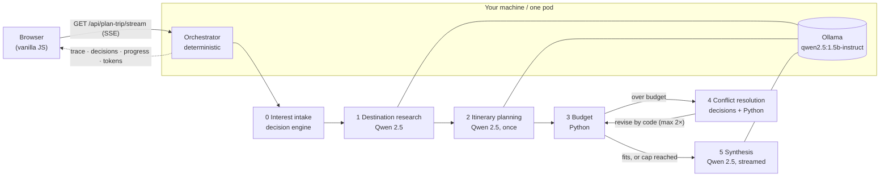

# Trip Planner: a Chain-of-Agents Orchestrator demo

You type a trip request ("Kyoto, 5 days, $1,200, solo, food and temples") and watch a **chain of specialised agents** pass the work along in real time until they produce a day-by-day itinerary that has been checked against your budget. Everything runs on your machine: a small local LLM (**Qwen 2.5 via Ollama**) plus a non-generative **decision engine**. No external APIs are called and no API keys are needed.

The point isn't a pretty itinerary. The point is to **make the orchestration visible**: which agent is working, what it passed to the next one, which decisions it took (with their probabilities), where a conflict came up (over budget) and how the chain resolved it without a human stepping in.

It implements three patterns from *"30 Agents Every AI Engineer Must Build"* (Imran Ahmad, Packt, ch. 7):

| Pattern | Where it lives |
|---|---|
| **Chain-of-Agents Orchestrator**: one component owns control flow and hand-offs, and does no domain work itself | `app/orchestrator.py` |
| **Memory-Augmented Multi-Agent System**: one shared context object that every agent reads and that only grows | `app/models.py` (`SharedContext`) |
| **Conflict Resolution Mechanism**: detects a broken constraint (budget) and renegotiates, with a hard iteration cap | `app/agents/conflict_resolution.py` + the orchestrator loop |

## Two kinds of reasoning: generate once, decide many times

A small model on a CPU produces only a few tokens per second, so the demo spends generation only where text actually has to be written. Every other step is either a **typed decision** or **plain arithmetic**:

| Step | Kind | How |
|---|---|---|
| Interest intake | decision | Map each free-text interest to a fixed taxonomy (food, religion/heritage, museums…) |
| Destination research | catalog + **generative** | For ~45 popular cities, real districts, well-known highlights and cost levels come from a curated catalog (`app/data/cities.json`), and Qwen only writes the season notes. For other destinations Qwen estimates everything. The trace shows which source was used |
| Itinerary planning | **generative, once** | Qwen writes the day-by-day plan, **including a free alternative per day** |
| Budget | arithmetic | Python adds lodging, food, activities and transport, then compares the total to the budget |
| Conflict resolution | decision + arithmetic | Code computes each preset action's savings; the decision engine scores how much each action would hurt the traveller's interests; code ranks by `savings × (1 − P(harm))` |
| Itinerary revision | code | Code applies the chosen actions (swaps in the free alternatives, lowers daily costs). **No new generation** |
| Plan validation | decision | "Does the revised plan still match the interests?", answered as a probability and shown in the trace |
| Synthesis | **generative** + code | Qwen writes a short narrative, streamed token by token. It never sees any number and must not talk about money. The budget paragraph (total, cuts applied, fits or not) is written by code, so the honest part can't be hallucinated |

The **decision engine** (`app/decisions/`) follows the shape of *System-One* typed-decision models such as TypeSafe's Jev. The caller sends a *state* and a list of typed questions (`choice` with options, or `score` → P(yes)) and gets typed answers with probabilities back, never free text. Each question carries a machine `family` and a natural-language `text`, so engines are interchangeable. The engine that ships is **rule-based** (a keyword taxonomy plus explicit heuristics). It is deterministic, instant and offline. A model-backed engine only needs to implement `evaluate()`.

### Why a curated catalog

The first runs with the real 1.5B model got facts wrong: it put Shibuya (Tokyo) in Kyoto, invented districts and priced Hanoi above Lisbon. Prompts can't fix a small model's missing knowledge, so the facts that have to be right are stored as data. Each district in the catalog lists the highlights that are really located there. Code decides which district each day visits and passes the model only that district's highlights, so a landmark can't end up on the wrong day or in the wrong neighbourhood. The catalog is hand-written, reviewable and covered by tests, and it is matched by name, Spanish and English aliases or a small typo ("Kioto", "Lisboa", "Barcelonna"). The model still writes everything that is prose.

## Architecture



Two containers:

- **app** (`Dockerfile`): FastAPI + Uvicorn. Serves the UI and streams the chain over SSE on port 8080.
- **ollama** (`ollama/Dockerfile`): Ollama with `qwen2.5:1.5b-instruct` built into the image, so it needs no download at startup. It serves on port 11434 and is reachable only by the app.

### The shared context (`SharedContext`)

One JSON object travels through the whole chain. Every agent receives all of it and returns **only its own section**. The orchestrator is the only component that merges sections. Sections are never deleted; a section is only replaced by a newer revision of itself.

```jsonc
{
  "session_id": "uuid",
  "user_request":        { "destination": "Kyoto", "days": 5, "budget_usd": 1200, "travelers": 1, "interests": ["food", "temples"], "lang": "en" },
  "interest_profile":    { "matches": [{ "interest": "food", "category": "food", "probability": 0.9 }] },
  "destination_research":{ "season_notes": "…", "recommended_areas": ["…"], "reference_costs": { "lodging_per_night_usd": 0, "meal_avg_usd": 0, "local_transport_day_usd": 0 }, "agent_notes": "…" },
  "itinerary_draft":     { "days": [{ "day": 1, "area": "…", "activities": ["…"], "estimated_cost_usd": 0, "free_alternative": "…", "adjusted": false }],
                           "cost_assumptions": { "lodging_per_night_usd": 0, "food_per_day_usd": 0, "transport_per_day_usd": 0 }, "revision": 0 },
  "budget_analysis":     { "estimated_total_usd": 0, "over_budget_by_usd": 0, "breakdown": { "lodging": 0, "food": 0, "activities": 0, "transport": 0 }, "within_budget": true },
  "conflict_resolution": { "triggered": false, "iterations": 0, "actions_taken": [], "applied_action_ids": [],
                           "decisions": [{ "question": "harm:cheaper_lodging", "answer": 0.1, "probabilities": { "yes": 0.1, "no": 0.9 }, "source": "rules" }], "resolved": null },
  "final_itinerary":     { "summary": "…", "days": [], "total_cost_usd": 0, "budget_usd": 0, "within_budget": true, "breakdown": {} },
  "trace":               [{ "agent": "orchestrator", "event": "decision", "timestamp": "iso8601", "decision": { } }],
  "token_usage":         { "itinerary_planning": { "input_tokens": 0, "output_tokens": 0 } }
}
```

The generative agents' output is constrained to a JSON schema through Ollama structured outputs (`format`) and validated with Pydantic. If the output is still invalid, the agent retries once and then fails in a controlled way. Numbers returned by the model are clamped to sane ranges in code.

## Prerequisites

- **Docker with Compose** (recommended), **or** Python 3.12+ plus a local [Ollama](https://ollama.com) install.
- About 3 GB of disk for the Ollama image with the model, and about 2–3 GB of free RAM. No GPU is needed.

## Build & run

### Docker Compose (recommended)

```bash
docker compose up --build
# open http://localhost:8080
```

The first build downloads the model into the Ollama image. After that, startups are offline. To try a different Qwen size, run `OLLAMA_MODEL=qwen2.5:0.5b-instruct docker compose up --build`. The 0.5b model is about 3× faster on a CPU but its writing is rougher. The 3b model writes better but is slower.

### Local Python

```bash
ollama pull qwen2.5:1.5b-instruct        # once; Ollama must be running
python -m venv .venv && source .venv/bin/activate
pip install -r requirements-dev.txt
uvicorn app.main:app --host 0.0.0.0 --port 8080 --reload
```

### Without any model (mock mode)

```bash
LLM_MODE=mock uvicorn app.main:app --port 8080     # canned, deterministic agents
python -m pytest -q                                # offline test suite (uses mock mode)
```

### End-to-end check with the real model

```bash
docker compose -f docker-compose.yml -f docker-compose.ci.yml up -d --build --wait   # pod-sized limits
python scripts/smoke_e2e.py --base-url http://localhost:8080
```

The script plans four real trips (three catalog cities and one outside the catalog) and reports latency per agent, tokens and quality signals. It fails if a run breaks or if the summary contradicts the computed budget verdict. CI runs it on every push. The separate `Model benchmark` workflow runs the same trips on `qwen2.5:1.5b-instruct` and `qwen2.5:3b-instruct` side by side.

## Configuration (environment variables)

| Variable | Default | Purpose |
|---|---|---|
| `LLM_MODE` | `ollama` | Set `mock` for canned, model-free agents (UI work, tests). |
| `OLLAMA_HOST` | `http://localhost:11434` | Ollama server URL. Compose sets `http://ollama:11434`. |
| `OLLAMA_MODEL` | `qwen2.5:1.5b-instruct` | Model tag. It must exist in the Ollama server. |
| `DECISION_ENGINE` | `rules` | Engine for typed decisions. `rules` is the only one available today. |
| `MAX_TOKENS_PER_SESSION` | `6000` | Tokens one trip may consume (prompt + generated, all LLM calls). |
| `CHAIN_TIMEOUT_SECONDS` | `180` | Hard wall-clock limit for one chain. |
| `MAX_CONCURRENT_SESSIONS` | `1` | Chains running at once. CPU inference is serialized anyway. |
| `MAX_REQUESTS_PER_IP_PER_HOUR` | `10` | Per-client rate limit (in memory, using `X-Forwarded-For` when present). |
| `MAX_SESSIONS_PER_HOUR` | `30` | Limit on trips per hour across all clients. |
| `MAX_CONFLICT_ITERATIONS` | `2` | Conflict-loop cap. Values above 2 are clamped to 2. |
| `MOCK_LATENCY_MS` | `600` | Simulated latency per agent in mock mode. |
| `PROJECT_ID`, `DEMO_SLOT` | – | Optional identifiers reported by `/api/health`. |

## Usage

1. Open `/`, fill in the destination, days (1–7), budget, travelers and interests, then click **Plan trip**.
2. The **Agent trace** panel (left) shows every step as it happens: ⏳ working (with a live token counter while Qwen generates), ✅ done, 🎯 decision (question → answer, probability and engine), ⚠️ conflict detected.
3. The **Itinerary** panel (right) fills in as it goes: the interest profile, the research, the draft (day by day), the budget breakdown and the chosen cuts. Finally the narrative appears, typed out as it streams.
4. **Try an unrealistic budget ($50)** forces the conflict loop. You'll see two rounds of scored decisions, days marked *adjusted*, and a result that honestly says the plan is still over budget.

### HTTP API

| Endpoint | Description |
|---|---|
| `GET /` | Single-page UI. |
| `GET /api/health` | Liveness: `{"status":"ok","llm_ready":…}`. `llm_ready` turns true once the model is loaded. |
| `GET /api/config` | Public settings (mode, model, decision engine, limits). |
| `GET /api/plan-trip/stream?destination=&days=&budget_usd=&travelers=&interests=a,b&lang=es\|en` | SSE stream of the chain. |

Stream events: `session`; `trace` (every step transition and every decision); `section` (`{key, value}` whenever a context section changes); `progress` (`{agent, tokens}` while a structured generation runs); `token` (`{agent, text}`, the synthesis narrative as it streams); and at the end `done` (the full final context) or `error` (`{code, message}`, where `code` is one of `invalid_request`, `rate_limited`, `global_limit`, `busy`, `timeout`, `chain_failed`, `internal`). Every outcome, including validation errors and refusals, arrives as an SSE event. The client must close its `EventSource` after `done` or `error`, because an automatic reconnect would start a new run.

## Deployment notes

- The app is **stateless and ephemeral**: nothing is stored between requests, and it tolerates being stopped at any moment. The model is loaded in the background at startup (`llm_ready`), and the first request after a cold start can take longer.
- It serves plain HTTP on `0.0.0.0:8080` from the root path `/`, with **no TLS and no authentication**. It is designed to run behind a reverse proxy or gateway that terminates TLS and handles authentication. SSE responses set `Cache-Control: no-cache` and `X-Accel-Buffering: no`.
- The Ollama container needs no inbound access except from the app. If both containers share a network namespace (one pod), keep the default `OLLAMA_HOST=http://localhost:11434`.
- Suggested sizing: about 2 vCPU / 4 GiB in total, biased towards Ollama (for example, Ollama 1.75 vCPU / 3 GiB and the app 0.25 vCPU / 1 GiB).
- If the client disconnects mid-run, the chain is cancelled so it stops using CPU.

## Limitations

- Costs are approximate references: from the curated catalog for known cities, otherwise estimates from the small model's general knowledge (clamped to sane ranges). There are no live prices, and flights to the destination aren't included.
- Outside the catalog, a 1.5B model can still pick wrong districts or invent places.
- The narrative is filtered in code: markdown is stripped, and a sentence is dropped if it talks about money or names a place ("Museum of X", "X Park") that appears nowhere in the plan. The filter is a heuristic, so a wrong detail attached to a known name (for example "Kyoto Central station") can still slip through.
- CPU inference: about 35–40 s per 3-day trip with the model on 1.75 vCPU (measured in CI with pod-like limits), dominated by the itinerary and the narrative.
- A 1.5B model occasionally writes rough text or picks odd areas. Pick a larger model if your hardware allows it.
- The rule-based decision engine understands the keywords in its taxonomy (Spanish and English). Interests outside it map to `other`.
- Trips are capped at 7 days, with one night of lodging per trip day.
- Rate limits live in memory and apply to a single replica.

## Possible v2

A model-backed decision engine (a typed-decision model such as Jev, behind the same `evaluate()` interface), real travel APIs, a map view, and persisting finished plans.

## References

- Imran Ahmad, *30 Agents Every AI Engineer Must Build*, Packt, chapter 7: Chain-of-Agents Orchestrator, Memory-Augmented Multi-Agent Systems, Conflict Resolution Mechanisms.
- TypeSafe AI, *Introducing System One Models & Jev*: https://typesafe.ai/blog/introducing-system-one-models-and-jev
- Qwen 2.5 via Ollama: https://ollama.com/library/qwen2.5
